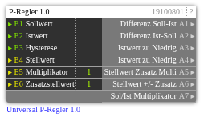

# Universal P-Regler 1.0

**ID:** `19100801`  
**Importdatei:** [`19100801_lbs.php`](../../LBS/19100801/19100801_lbs.php)  
**Beschreibung:** P-Regler für Soll-/Istwert, Hysterese und Stellwertkorrektur.

**Bild online:** https://raw.githubusercontent.com/x3muha/edomi-lbs/main/docs/images/19100801.png

## Hilfe

Version: 1.0

Universal P-Regler (19100801)

Zweck:
- Vergleicht Sollwert (E1) und Istwert (E2) mit Hysterese (E3).
- Liefert Richtungsbits (zu niedrig / zu hoch) und berechnet Stellwertkorrekturen.

Eingänge:
- E1 Sollwert
- E2 Istwert
- E3 Hysterese (Totband)
- E4 Stellwert (Basis)
- E5 Multiplikator (P-Anteil)
- E6 Zusatzstellwert (Offset)

Kernlogik:
1) var1 = (Soll-Ist)-Hysterese
2) var2 = (Ist-Soll)-Hysterese
3) var1>0 => A3=1 (Ist zu niedrig): Stellwert wird erhöht
4) var2>0 => A4=1 (Ist zu hoch): Stellwert wird reduziert

Ausgänge:
- A1/A2: reine Differenzen
- A3/A4: Richtungsbits
- A5: finaler Stellwert inkl. Multiplikator + Zusatz
- A6: Stellwert +/- Zusatz
- A7: Multiplikatoranteil

Hinweis:
- Ausgänge werden nur bei Wertänderung gesendet (_setChanged), um Telegrammflut zu vermeiden.
- E5=0 deaktiviert den proportionalen Anteil effektiv.
