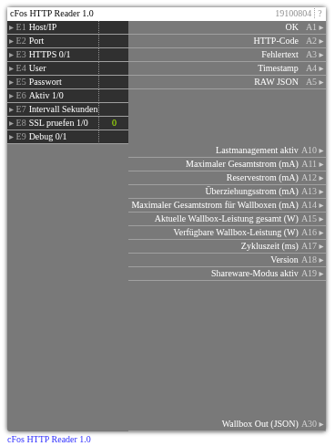

# cFos HTTP Reader 1.0

**ID:** `19100804`  
**Importdatei:** [`19100804_lbs.php`](../../LBS/19100804/19100804_lbs.php)  
**Beschreibung:** Zyklischer Reader für cFos /cnf?cmd=get_dev_info.

## Hilfe

Version: 1.0

cFos HTTP Reader (19100804)

Zweck:
- Zyklischer Reader für cFos /cnf?cmd=get_dev_info.
- Liefert globale Lastmanagement-Parameter und EVSE-Liste als JSON.

Betrieb:
- E6=1 startet den Zyklus, E6=0 stoppt.
- E7 Intervall in Sekunden.
- E1..E5 Host/Port/HTTPS/Auth.
- E8=1 aktiviert SSL-Zertifikatspruefung bei HTTPS; Standard 0 fuer lokale/self-signed cFos-Installationen.
- HTTP/curl laeuft im EXEC-Teil, damit ein nicht erreichbarer cFos die Logik nicht blockiert.
- Ausgaenge werden nur bei Wertwechsel geschrieben. Bei Aktiv=0 bleiben die letzten Ausgangswerte stehen.

Ausgänge:
- A10..A19: globale cFos-Parameter (Ströme, Leistung, Version, Shareware)
- A30: Wallboxen als JSON (E*-Devices), für Decoder 19100805.
- A1/A2/A3: OK/HTTP-Code/Fehlertext.
