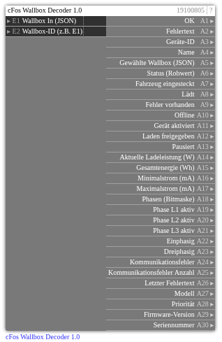

# cFos Wallbox Decoder 1.0

**ID:** `19100805`  
**Importdatei:** [`19100805_lbs.php`](../../LBS/19100805/19100805_lbs.php)  
**Beschreibung:** Dekodiert eine einzelne Wallbox aus dem Reader-JSON von 19100804.

## Hilfe

Version: 1.0

cFos Wallbox Decoder (19100805)

Zweck:
- Dekodiert eine einzelne Wallbox aus dem Reader-JSON (A30 von 19100804).

Eingänge:
- E1 Wallbox-JSON (Liste)
- E2 gewünschte dev_id (z. B. E1)

Kernlogik:
- Sucht exakt die gewünschte Wallbox-ID.
- Dekodiert state, charging, enabled, paused, power, phases, com-error, model etc.
- Zerlegt model-String zusätzlich in Firmware (A29) und Seriennummer (A30).

Statusinterpretation:
- A7 Fahrzeug eingesteckt bei state 2..5
- A8 lädt bei state 3/4
- A9 Fehler bei state 5 oder Kommunikationsfehler
- A10 offline bei state 6
