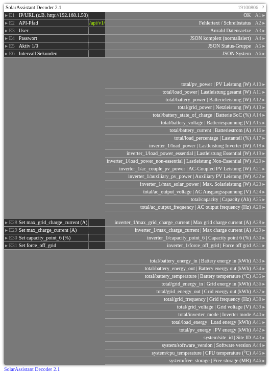

# SolarAssistant Decoder 2.1

**ID:** `19100806`  
**Importdatei:** [`19100806_lbs.php`](../../LBS/19100806/19100806_lbs.php)  
**Beschreibung:** SolarAssistant per REST lesen und ausgewaehlte Inverter-Einstellungen schreiben.

**Bild online:** https://raw.githubusercontent.com/x3muha/edomi-lbs/main/docs/images/19100806.png

## Hilfe

Version: 2.1

SolarAssistant Decoder 2.1

Zweck:
- Holt JSON zyklisch von SolarAssistant REST API und gibt Kernwerte auf feste Ausgaenge aus.
- Schreibt ausgewaehlte Inverter-Einstellungen ueber SolarAssistant REST API.
- Schreiben erfolgt per POST /api/v1/metrics; A2 zeigt den Schreibstatus.
- Bei ungueltiger/leerer Antwort bleiben letzte gueltige Nutzwerte stehen.

Betrieb:
- E1 = Basis-URL/IP (z. B. http://192.168.1.50)
- E2 = API-Pfad (Standard /api/v1/metrics)
- E3/E4 = User/Passwort
- E5 = Aktiv (1 startet zyklische Abfrage)
- E6 = Intervall in Sekunden
- E28 = max_grid_charge_current in A
- E29 = max_charge_current in A
- E30 = capacity_point_6 in %
- E31 = force_off_grid
- HTTP/cURL laeuft im EXEC-Teil, damit die Logik nicht blockiert.

Ausgaenge:
- A10..A24: bisherige Kernwerte.
- A25..A26 und A33..A42: weitere total/* Werte aus der aktuellen API.
- A28..A31: ausgewaehlte Inverter-Statuswerte mit gleich nummeriertem
  Schreibeingang.
- A43..A46: system/* Werte aus /api/v1/system.
- A27 und A32 bleiben bewusst frei.

Schreiben:
- MQTT-Topic `solar_assistant/inverter_1/capacity_point_6/set` entspricht
  REST-Set auf `inverter_1/capacity_point_6`.
- Ein Refresh auf E28..E31 schreibt sofort den jeweiligen Eingangswert per
  POST /api/v1/metrics.
- Falls EDOMI beim manuellen Eintragen kein Refresh-Flag setzt, schreibt der
  Baustein den geaenderten nicht-leeren Wert nach der ersten Baseline beim
  naechsten Lauf.
- A2 zeigt danach `Schreiben OK: ...` oder den von SolarAssistant gelieferten
  Fehlertext.

Fehlerbild:
- A2 liefert Text bei URL/Auth/JSON-Fehlern und beim Schreiben den Status.
