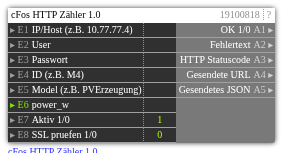

# cFos HTTP Zähler 1.0

**ID:** `19100818`  
**Importdatei:** [`19100818_lbs.php`](../../LBS/19100818/19100818_lbs.php)  
**Beschreibung:** Sendet model + power_w per POST an cFos set_ajax_meter.

## Hilfe

Version: 1.0

cFos HTTP Zähler Sender

Zweck:
- Sendet model + power_w per POST an cFos set_ajax_meter.

Request:
- URL: /cnf?cmd=set_ajax_meter&dev_id=<ID>
- Body: {"model":"...","power_w":...}

Hinweise:
- ID direkt als Mx eintragen (z. B. M4).
- Negative Leistung erlaubt.
- Versand bei Trigger auf E6 oder Konfig-Änderung.
- E8=1 aktiviert SSL-Zertifikatspruefung bei HTTPS; Standard 0 fuer lokale/self-signed cFos-Installationen.
- Der HTTP-Request laeuft im EXEC-Teil, damit ein nicht erreichbarer cFos die Logik nicht blockiert.
- Ausgaenge werden nur bei Wertwechsel geschrieben. Bei Aktiv=0 bleiben die letzten Ausgangswerte stehen.
