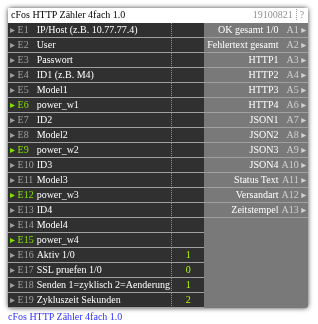

# cFos HTTP Zähler 4fach 1.0

**ID:** `19100821`  
**Importdatei:** [`19100821_lbs.php`](../../LBS/19100821/19100821_lbs.php)  
**Beschreibung:** Sendet vier cFos-Zähler mit gemeinsamer Host/User/Pass-Konfiguration.

## Hilfe

Version: 1.0

cFos HTTP Zaehler 4fach

Zweck:
- Sendet 4 cFos-Zaehler mit nur einer gemeinsamen Host/User/Pass-Konfiguration.
- Sendet immer alle konfigurierten Zaehler gemeinsam in einem EXEC-Lauf.

Eingaenge:
- E18=1 sendet zyklisch. E19 ist die Zykluszeit in Sekunden, Standard 2s.
- E18=2 sendet bei Aenderung auf E6/E9/E12/E15. Schnelle Aenderungen werden kurz gesammelt und dann gemeinsam gesendet.

Request je Zaehler:
- POST /cnf?cmd=set_ajax_meter&dev_id=<IDx>
- Body: {"model":"...","power_w":...}

Hinweise:
- Negative power_w erlaubt.
- Leere ID wird uebersprungen.
- E17=1 aktiviert SSL-Zertifikatspruefung bei HTTPS; Standard 0 fuer lokale/self-signed cFos-Installationen.
- A1=1 nur wenn alle gesendeten Zaehler HTTP 2xx liefern.
- Der HTTP-Request laeuft im EXEC-Teil, damit ein nicht erreichbarer cFos die Logik nicht blockiert.
- Ausgaenge werden nur bei Wertwechsel geschrieben. Bei Aktiv=0 bleiben die letzten Ausgangswerte stehen.
