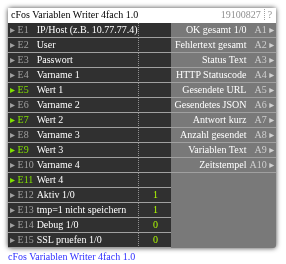

# cFos Variablen Writer 4fach 1.0

**ID:** `19100827`  
**Importdatei:** [`19100827_lbs.php`](../../LBS/19100827/19100827_lbs.php)  
**Beschreibung:** Schreibt bis zu vier Charging-Manager-Variablen in cFos.

## Hilfe

Version: 1.0

cFos Variablen Writer 4fach

Zweck:
- Schreibt bis zu 4 Charging-Manager-Variablen in cFos.
- Gemeinsame IP/User/Pass-Konfiguration, Versand bei Trigger auf einem Wert oder Konfig-Aenderung.

Request:
- POST /cnf?cmd=set_cm_vars
- Body: {"vars":[{"name":"var1","expr":123},{"name":"var2","expr":"text"}]}
- E13=1 fuegt tmp=1 an und schont den Flash-Speicher bei haeufigen Updates.

Hinweise:
- Leere Variablennamen oder Werte werden uebersprungen; 0 ist ein gueltiger Wert und wird gesendet.
- Zahlen werden numerisch gesendet, Texte/Formeln als String.
- E15=1 aktiviert SSL-Zertifikatspruefung bei HTTPS; Standard 0 fuer lokale/self-signed cFos-Installationen.
- Passwort wird nicht auf Ausgaenge geschrieben.
- Der HTTP-Request laeuft im EXEC-Teil, damit ein nicht erreichbarer cFos die Logik nicht blockiert.
- Ausgaenge werden nur bei Wertwechsel geschrieben. Bei Aktiv=0 bleiben die letzten Ausgangswerte stehen.
