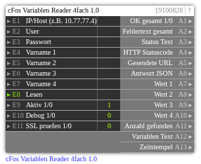

# cFos Variablen Reader 4fach 1.0

**ID:** `19100828`  
**Importdatei:** [`19100828_lbs.php`](../../LBS/19100828/19100828_lbs.php)  
**Beschreibung:** Liest bis zu vier Charging-Manager-Variablen aus cFos.

**Bild online:** https://raw.githubusercontent.com/x3muha/edomi-lbs/main/docs/images/19100828.png

## Hilfe

Version: 1.0

cFos Variablen Reader 4fach

Zweck:
- Liest bis zu 4 Charging-Manager-Variablen aus cFos.
- E8 triggert den Lesevorgang. Konfig-Aenderungen alleine starten keinen HTTP-Request.

Request:
- GET /cnf?cmd=get_cm_vars
- Antwort ist ein JSON Objekt mit den Charging-Manager-Variablen.

Hinweise:
- User/Pass werden fuer HTTP Basic Auth genutzt, wenn User gesetzt ist.
- Leere Variablennamen werden uebersprungen.
- Pro Variable wird bevorzugt der berechnete Wert ausgegeben; falls nicht vorhanden, die Formel/Konstante.
- E11=1 aktiviert SSL-Zertifikatspruefung bei HTTPS; Standard 0 fuer lokale/self-signed cFos-Installationen.
- Passwort wird nicht auf Ausgaenge geschrieben.
- Der HTTP-Request laeuft im EXEC-Teil, damit ein nicht erreichbarer cFos die Logik nicht blockiert.
- Ausgaenge werden nur bei Wertwechsel geschrieben. Bei Aktiv=0 bleiben die letzten Ausgangswerte stehen.
