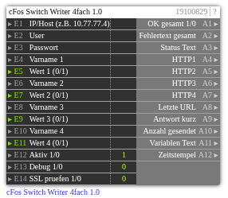

# cFos Switch Writer 4fach 1.0

**ID:** `19100829`  
**Importdatei:** [`19100829_lbs.php`](../../LBS/19100829/19100829_lbs.php)  
**Beschreibung:** Schreibt bis zu vier als Switch/Bool deklarierte cFos Charging-Manager-Variablen.

## Hilfe

Version: 1.0

cFos Switch Writer 4fach

Zweck:
- Schreibt bis zu 4 als Switch/Bool deklarierte cFos Charging-Manager-Variablen.
- Gemeinsame IP/User/Pass-Konfiguration, Versand bei Trigger auf einem Wert oder Konfig-Aenderung.

Request je Variable:
- GET /cnf?cmd=set_cm_var&name=<Varname>&val=<0|1>

Hinweise:
- Leere Variablennamen oder Werte werden uebersprungen; 0 ist ein gueltiger Wert und wird gesendet.
- Akzeptierte Werte: 0/1, true/false, on/off, ein/aus, ja/nein.
- E14=1 aktiviert SSL-Zertifikatspruefung bei HTTPS; Standard 0 fuer lokale/self-signed cFos-Installationen.
- Passwort wird nicht auf Ausgaenge geschrieben.
- Der HTTP-Request laeuft im EXEC-Teil, damit ein nicht erreichbarer cFos die Logik nicht blockiert.
- Ausgaenge werden nur bei Wertwechsel geschrieben. Bei Aktiv=0 bleiben die letzten Ausgangswerte stehen.
