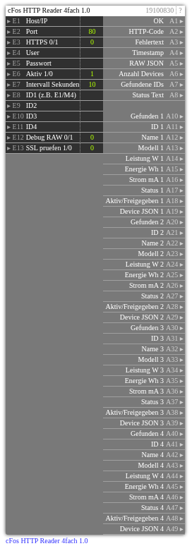

# cFos HTTP Reader 4fach 1.0

**ID:** `19100830`  
**Importdatei:** [`19100830_lbs.php`](../../LBS/19100830/19100830_lbs.php)  
**Beschreibung:** Zyklischer 4fach-Reader für cFos /cnf?cmd=get_dev_info.

## Hilfe

Version: 1.0

cFos HTTP Reader 4fach (19100830)

Zweck:
- Zyklischer Reader fuer cFos /cnf?cmd=get_dev_info.
- Liest einmal pro Zyklus alle cFos-Devices und dekodiert bis zu 4 frei waehlbare IDs.
- Geeignet fuer Wallboxen (E*) und Zaehler/HTTPMeter (M*), solange die Werte im cFos-Device enthalten sind.

Eingaenge:
- E1..E5 Host/Port/HTTPS/Auth.
- E6=1 startet den Zyklus, E6=0 stoppt.
- E7 Intervall in Sekunden.
- E8..E11 Device-IDs, z. B. E1, E2, M4.
- E12=1 schreibt komplettes RAW JSON auf A5, sonst bleibt A5 leer.
- E13=1 aktiviert SSL-Zertifikatspruefung bei HTTPS; Standard 0 fuer lokale/self-signed cFos-Installationen.

Ausgaenge je Device:
- Gefunden, ID, Name, Modell.
- Leistung W: erster vorhandener Wert aus power_w, cur_power, cur_charging_power, power.
- Energie Wh: erster vorhandener Wert aus total_energy, energy_wh, import_wh, export_wh.
- Strom mA: erster vorhandener Wert aus current, cur, charging_cur, max_charging_cur.
- Status: state oder status.
- Aktiv/Freigegeben: device_enabled oder charging_enabled.
- Device JSON: kompletter gefundener Device-Datensatz.

Hinweise:
- HTTP/curl laeuft im EXEC-Teil, damit ein nicht erreichbarer cFos die Logik nicht blockiert.
- A1=1 bedeutet: cFos erreichbar, JSON gueltig. Einzelne nicht gefundene IDs setzen nur den jeweiligen Gefunden-Ausgang auf 0.
- Ausgaenge werden nur bei Wertwechsel geschrieben. Bei Aktiv=0 bleiben die letzten Ausgangswerte stehen.
