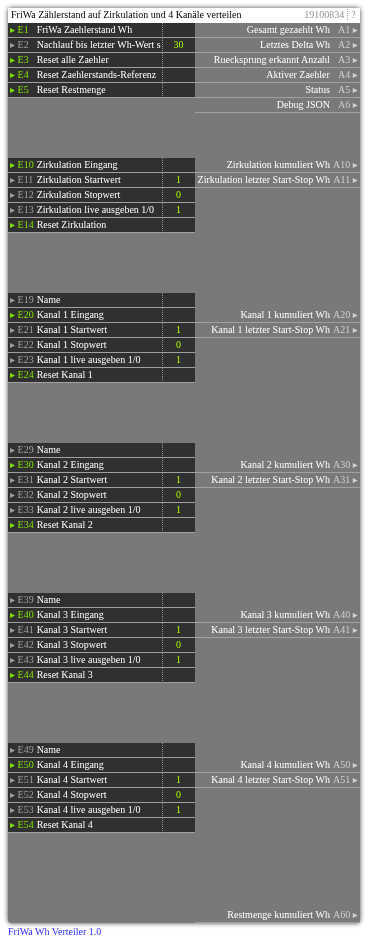

# FriWa Wh Verteiler 1.0

**ID:** `19100834`  
**Importdatei:** [`19100834_lbs.php`](../../LBS/19100834/19100834_lbs.php)  
**Beschreibung:** FriWa-Zählerstand auf Zirkulation und vier Kanäle verteilen.

**Bild online:** https://raw.githubusercontent.com/x3muha/edomi-lbs/main/docs/images/19100834.png

## Hilfe

Version: 1.0

FriWa Wh Verteiler (19100834)

Zweck:
- Verteilt einen monoton steigenden FriWa-Zaehlerstand in Wh auf Zirkulation und vier frei belegbare Kanaele.
- Der FriWa-Zaehlerstand kommt an E1 und darf bei Ueberlauf oder Reset wieder kleiner werden.
- Der Baustein bildet immer nur das Delta zwischen zwei empfangenen Zaehlerstaenden.
- Wenn der neue Zaehlerstand kleiner als der alte ist, wird ein Ruecksprung erkannt. Das Delta wird dann ab 0 mit dem neuen Wert weitergezaehlt. Dadurch geht maximal der nicht uebertragene Rest vor dem Ruecksprung verloren.
- Alle Summen und Phasenwerte werden in remanenten V-Werten gespeichert und ueberstehen einen EDOMI-Neustart.
- Technisch sind diese Werte im DEF als `V# REMANENT` deklariert. Normale `V#` waeren nur RAM-Werte und waeren dafuer nicht ausreichend.

Grundprinzip:
- Es gibt genau einen Zaehlerkontext, dem ein neues Wh-Delta zugeschlagen wird.
- Kanal 1 bis Kanal 4 sind normale Zaehler.
- Zirkulation ist der Hintergrundzaehler und zaehlt nur, wenn kein normaler Kanal aktiv ist und kein normaler Kanal im Nachlauf steht.
- Restmenge zaehlt Wh-Deltas, wenn kein normaler Kanal, keine Zirkulation und kein Nachlauf aktiv ist.
- Bei mehreren aktiven normalen Kanaelen gewinnt der zuletzt gestartete Kanal.
- Wenn der zuletzt gestartete Kanal stoppt und ein frueher gestarteter Kanal noch aktiv ist, zaehlt der Baustein danach wieder fuer diesen frueheren Kanal.

Eingangsgruppen:
- Zirkulation: E10 Eingang, E11 Startwert, E12 Stopwert, E13 Live-Ausgabe, E14 Reset.
- Kanal 1: E19 Name, E20 Eingang, E21 Startwert, E22 Stopwert, E23 Live-Ausgabe, E24 Reset.
- Kanal 2: E29 Name, E30 Eingang, E31 Startwert, E32 Stopwert, E33 Live-Ausgabe, E34 Reset.
- Kanal 3: E39 Name, E40 Eingang, E41 Startwert, E42 Stopwert, E43 Live-Ausgabe, E44 Reset.
- Kanal 4: E49 Name, E50 Eingang, E51 Startwert, E52 Stopwert, E53 Live-Ausgabe, E54 Reset.
- Die Name-Eingaenge sind reine Notizfelder und werden von der Logik nicht ausgewertet.

Start/Stop-Werte:
- Jeder Kanal hat einen Eingang und zwei Sollwerte.
- Standard ist Startwert 1 und Stopwert 0.
- Andere Werte sind erlaubt, z. B. Eingang 27 startet, Eingang 0 stoppt.
- Der Vergleich erfolgt numerisch, wenn beide Werte numerisch sind, sonst als Textvergleich.
- Wenn Startwert und Stopwert gleich sind, gewinnt Start. Diese Einstellung ist nicht sinnvoll und wird im Debug sichtbar.

Nachlauf:
- E2 legt fest, wie lange nach einem Stop noch auf den letzten Wh-Zaehlerstand gewartet wird. Standard: 30 Sekunden.
- Der Nachlauf wird nur genutzt, wenn nach dem Stop kein normaler Kanal aktiv ist.
- Kommt waehrend des Nachlaufs ein normaler Kanal auf Start, zaehlt der neue Kanal sofort.
- Ist nach Stop eines normalen Kanals ein anderer normaler Kanal noch aktiv, wird sofort auf diesen zurueckgeschaltet.
- Erst wenn kein normaler Kanal aktiv ist und kein Nachlauf mehr laeuft, darf Zirkulation wieder zaehlen.

Beispiele:
- Zirkulation aktiv, kein Kanal aktiv: neue Wh-Deltas gehen auf A10.
- Kanal 1 startet: Zirkulation wird unterbrochen, neue Wh-Deltas gehen auf A20.
- Kanal 2 startet waehrend Kanal 1 aktiv ist: Kanal 1 pausiert, Kanal 2 zaehlt.
- Kanal 2 stoppt, Kanal 1 ist weiterhin aktiv: Kanal 1 zaehlt weiter.
- Kanal 1 stoppt, kein anderer normaler Kanal ist aktiv: Kanal 1 bleibt fuer E2 Sekunden im Nachlauf, danach wird seine letzte Start-Stop-Phase abgeschlossen.

Ausgaben:
- A1 Gesamt gezaehlt Wh: Summe aller vom Baustein verarbeiteten positiven Deltas.
- A2 Letztes Delta Wh: letztes aus E1 berechnetes Delta.
- A3 Ruecksprung erkannt Anzahl: Anzahl der erkannten kleineren Zaehlerstaende.
- A4 Aktiver Zaehler: aus, zirkulation, kanal1, kanal2, kanal3, kanal4 oder restmenge.
- A5 Status: kurzer Klartext zum aktuellen Zustand.
- A6 Debug JSON: kompakte Diagnose mit Rohzustaenden, Sequenzen, Nachlauf und Summen.
- A10/A11: Zirkulation kumuliert und letzter Start-Stop.
- A20/A21 bis A50/A51: Kanal 1 bis 4 kumuliert und letzter Start-Stop.
- A60: Restmenge kumuliert.

Kumuliert und letzter Start-Stop:
- Kumuliert ist die dauerhaft aufaddierte Wh-Summe des Kanals.
- Letzter Start-Stop ist die Summe der letzten Phase dieses Kanals.
- Eine Phase beginnt, wenn der Eingang den Startwert erreicht.
- Eine Phase endet, wenn der Eingang den Stopwert erreicht und kein Nachlauf mehr offen ist.
- Wird ein Kanal durch einen anderen Kanal ueberlagert, bleibt seine Phase offen. Sie laeuft weiter, wenn er spaeter wieder der aktive Kontext wird.

Live-Ausgabe:
- Ist die Live-Ausgabe eines Kanals 1, werden seine Ausgaenge bei jeder relevanten Aenderung aktualisiert.
- Ist die Live-Ausgabe 0, werden seine Ausgaenge nur bei Stop/Phasenabschluss oder Reset aktualisiert.
- Die globalen Ausgaenge A1 bis A6 werden bei Wertwechsel immer aktualisiert.

Reset:
- E3 setzt alle Kanalzaehler, Phasen, Start-Sequenzen, Nachlauf und die globale Delta-Summe zurueck.
- E4 setzt nur die Zaehlerstands-Referenz zurueck. Der naechste E1-Wert wird dann als neuer Startpunkt gespeichert und erzeugt noch kein Delta.
- E5 setzt nur die Restmenge zurueck.
- E14/E24/E34/E44/E54 setzen nur den jeweiligen Kanal zurueck.
- Reset-Eingaenge reagieren auf Refresh; der konkrete Eingangswert ist egal.
- Nicht remanent sind nur Ausgangs- und Debug-Caches. Diese werden beim naechsten Lauf neu aufgebaut und enthalten keine fachlichen Zaehlerstaende.

Wichtige Hinweise:
- Der Baustein braucht E1 als echten Trigger bei jedem neuen FriWa-Zaehlerstand.
- Wenn EDOMI den gleichen Eingangswert mehrfach sendet, entsteht Delta 0 und es wird nichts aufaddiert.
- Ohne bekannten Maximalwert kann ein echter 64-bit-Ueberlauf nicht exakt rekonstruiert werden. Der Baustein erkennt den Ruecksprung und zaehlt ab dem neuen Wert weiter.
- Bei sehr grossen Zaehlerstaenden nutzt PHP intern Float-Arithmetik. Wh-Zaehler im normalen Anlagenbetrieb bleiben praktisch weit unter kritischen Bereichen.
- EXEC ist leer: keine HTTP-, SQL- oder Dateisystemarbeit.
