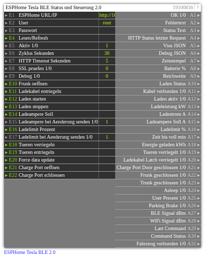

# ESPHome Tesla BLE 2.0

**ID:** `19100836`  
**Importdatei:** [`19100836_lbs.php`](../../LBS/19100836/19100836_lbs.php)  
**Beschreibung:** ESPHome Tesla BLE Status lesen und zentrale Steuerbefehle senden.

**Bild online:** https://raw.githubusercontent.com/x3muha/edomi-lbs/main/docs/images/19100836.png

## Hilfe

Version: 2.0

ESPHome Tesla BLE (19100836)

Zweck:
- Liest wichtige ESPHome-Tesla-BLE-Entities per ESPHome Web API.
- Gibt zentrale Werte einzeln und als kompaktes JSON fuer eine spaetere VSE aus.
- Sendet Steuerbefehle an ESPHome: Frunk oeffnen, Ladekabel entriegeln, Laden Start/Stop, Ladeampere, Ladelimit, Tueren Lock/Unlock, Charge Port Door.
- A31 zeigt den ESPHome-BLE-Verbindungsstatus des Fahrzeugs aus switch/BLE Connection als 1/0.
- A19..A23 sind numerische Statuswerte: 1 = geschlossen/verriegelt, 0 = offen/entriegelt. Unbekannte Rohwerte bleiben leer.

ESPHome-Seite:
- web_server muss aktiv sein.
- Bei gesetzter Authentifizierung E2/E3 belegen, z.B. User root und Passwort.
- Der Baustein nutzt HTTP-REST-Endpunkte wie /sensor/Battery?detail=all und POST /lock/Charge%20Port%20Latch/unlock.
- ESPHome-Projekt: https://github.com/yoziru/esphome-tesla-ble
- Tesla-BLE-Bibliothek: https://github.com/yoziru/tesla-ble

Eingaenge:
- E1: URL oder IP, z.B. http://10.0.1.141 oder 10.0.1.141
- E2/E3: Webserver-User/Passwort, Passwort wird nicht ausgegeben
- E4: manueller Lese-Trigger
- E5: Aktiv
- E6: zyklisches Lesen in Sekunden, 0 = nur Trigger/Konfigaenderung
- E10..E13 und E18..E22: Steuerbefehle, nur bei Trigger und Wert != 0
- E14: Ladeampere Soll. Bei Aenderung wird direkt gesendet, wenn E15=1 ist.
- E15: Senden von E14 bei Aenderung freigeben.
- E16: Ladelimit Prozent. Bei Aenderung wird direkt gesendet, wenn E17=1 ist.
- E17: Senden von E16 bei Aenderung freigeben.

Hinweise:
- HTTP laeuft im EXEC-Teil.
- Ausgaenge werden nur bei Wertwechsel geschrieben.
- Steuerbefehle werden vor dem Lesen ausgefuehrt; danach werden die Statuswerte neu gelesen.
