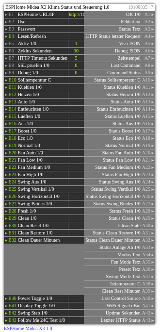

# ESPHome Midea X3 1.0

**ID:** `19100839`  
**Importdatei:** [`19100839_lbs.php`](../../LBS/19100839/19100839_lbs.php)  
**Beschreibung:** ESPHome Midea X3 Klima-, Fresh- und Clean-Status/Steuerung.

## Hilfe

Version: 1.0

ESPHome Midea X3 (19100839)

Zweck:
- Liest und steuert die Midea-X3-ESPHome-Firmware ueber die ESPHome Web API.
- Gibt Klima-, Fresh- und Clean-Status einzeln und als kompaktes JSON aus.
- Sendet Steuerbefehle an ESPHome ueber einzelne 1/0-Eingaenge fuer Modus, Preset, Fan, Swing, Fresh, Clean, Clean Restore und zusaetzliche Taster.

ESPHome-Seite:
- web_server muss aktiv sein.
- Erwartete Entity-Namen aus der Beispiel-YAML:
  - climate/Klimaanlage
  - switch/Midea Fresh
  - switch/Midea Clean
  - switch/Midea Clean Restore
  - number/Midea Clean Dauer
  - text_sensor/Midea Clean State
  - sensor/Midea Clean Remaining
  - text_sensor/Midea Last Control Source
  - sensor/Klima WiFi Signal
  - sensor/Klima Uptime
- Bei gesetzter Webserver-Authentifizierung E2/E3 belegen.

Eingaenge:
- E1: ESPHome URL oder IP, z.B. http://10.77.77.20 oder 10.77.77.20
- E2/E3: Webserver-User/Passwort
- E4: manueller Lese-Trigger
- E5: Aktiv
- E6: zyklisches Lesen in Sekunden, 0 = nur Trigger/Konfigaenderung
- E10: Solltemperatur in C.
- E11..E16: Betriebsart als 1/0-Eingang. 1 setzt den Modus, 0 loest keine Gegenaktion aus.
- E17..E19: Preset als 1/0-Eingang. 1 setzt Boost, Eco oder Normal.
- E20..E23: Fan Mode als 1/0-Eingang. 1 setzt Auto, Low, Medium oder High.
- E24..E27: Swing Mode als 1/0-Eingang. 1 setzt Aus, Vertikal, Horizontal oder Beides.
- E28: Fresh direkt setzen, 1=an, 0=aus.
- E29: Clean direkt setzen, 1=an, 0=aus.
- E30: Clean Reset, 1 loest Reset aus.
- E31: Clean Restore direkt setzen, 1=an, 0=aus.
- E32: Clean Dauer in Minuten.
- E40..E43: Power Toggle, Display Toggle, Swing Step, Follow Me 24C Test. 1 loest den Taster aus.

Ausgaenge:
- A1..A4: OK, Fehler, Status, letzter HTTP-Code.
- A5: kompaktes JSON fuer Visu/Weiterverarbeitung.
- A8/A9: letzter gesendeter Befehl und Befehlsstatus.
- A10..A32: Status passend zu den Eingangsnummern, z.B. E11 Kuehlen und A11 Status Kuehlen.
- A33..A43: zusaetzliche Status-/Diagnosewerte.

Hinweise:
- HTTP laeuft im EXEC-Teil.
- Bei jeder Eingangsaenderung wird sofort gearbeitet und nach ca. 2 Sekunden noch einmal gelesen.
- Ohne Eingangsaenderung gilt der normale Zyklus aus E6.
- Ausgaenge werden nur bei Wertwechsel geschrieben.
- ESPHome POSTs werden mit explizitem Content-Length gesendet, damit die Web API kein HTTP 411 liefert.
- Fresh-Status kommt aus der ESPHome-Entity Midea Fresh, die im Fork aus dem UART-Statusbit synchronisiert wird.
- Bei Fresh/Clean/Clean Restore wird ein erstes empfangenes 0 nicht als AUS gesendet. Erst nach einem gesehenen 1->0 Wechsel sendet der Baustein AUS.
- Clean-Status ist ESP-seitig geschaetzt; Clean Dauer und Clean Restore sind zur Laufzeit ueber E31/E32 steuerbar.
