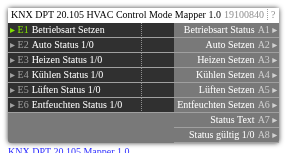

# KNX DPT 20.105 Mapper 1.0

**ID:** `19100840`  
**Importdatei:** [`19100840_lbs.php`](../../LBS/19100840/19100840_lbs.php)  
**Beschreibung:** KNX DPT 20.105 HVAC Control Mode zwischen DPT-Wert und 1/0-Modusobjekten mappen.

**Bild online:** https://raw.githubusercontent.com/x3muha/edomi-lbs/main/docs/images/19100840.png

## Hilfe

Version: 1.0

KNX DPT 20.105 Mapper (19100840)

Zweck:
- Wandelt einen DPT-20.105-Betriebsartwert in einzelne 1/0-Setzausgänge.
- Wandelt einzelne 1/0-Status-Eingänge wieder in einen DPT-20.105-Statuswert.

DPT 20.105 Werte:
- 0: Auto
- 1: Heizen
- 3: Kühlen
- 9: Lüften
- 14: Entfeuchten

Eingänge:
- E1: Betriebsart Setzen. DPT-20.105-Wert 0/1/3/9/14.
- E2: Auto Status 1/0.
- E3: Heizen Status 1/0.
- E4: Kühlen Status 1/0.
- E5: Lüften Status 1/0.
- E6: Entfeuchten Status 1/0.

Ausgänge:
- A1: Betriebsart Status als DPT-20.105-Wert.
- A2: Auto Setzen 1/0.
- A3: Heizen Setzen 1/0.
- A4: Kühlen Setzen 1/0.
- A5: Lüften Setzen 1/0.
- A6: Entfeuchten Setzen 1/0.
- A7: Status Text.
- A8: Status gültig 1/0.

Ablauf:
- Wenn E1 aktualisiert wird, setzt der Baustein genau einen Ausgang A2..A6 auf 1 und die anderen auf 0.
- Wenn ein Status-Eingang E2..E6 aktualisiert wird, setzt der Baustein A1 auf den passenden DPT-20.105-Wert.
- Wenn mehrere Status-Eingänge gleichzeitig 1 sind, gewinnt der zuerst gefundene aktive Status in der Reihenfolge Auto, Heizen, Kühlen, Lüften, Entfeuchten.
- Wenn kein Status-Eingang aktiv ist, wird A1 nicht neu geschrieben, A7 wird "Kein Status" und A8 wird 0.
- Unbekannte DPT-Werte an E1 schreiben keine Setzausgänge und setzen A7 auf "Unbekannt: <Wert>".

Hinweise:
- Reiner LBS-Baustein, kein EXEC-Code.
- DPT 20.105 wird hier als HVAC Control Mode für Klima-/Split-Gateways abgebildet.
