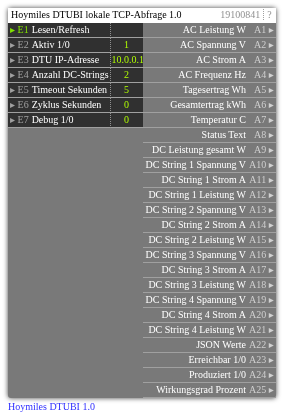

# Hoymiles DTUBI 1.0

**ID:** `19100841`  
**Importdatei:** [`19100841_lbs.php`](../../LBS/19100841/19100841_lbs.php)  
**Beschreibung:** Hoymiles HMS/HMT Wechselrichter mit integrierter WLAN-DTU lokal ueber TCP/Protobuf lesen.

**Bild online:** https://raw.githubusercontent.com/x3muha/edomi-lbs/main/docs/images/19100841.png

## Hilfe

Version: 1.0

Hoymiles DTUBI (19100841)

Zweck:
- Liest Hoymiles HMS/HMT Wechselrichter mit integrierter WLAN-DTU lokal ueber TCP/Protobuf.
- Nutzt das Python-Paket `hoymiles-wifi` auf dem EDOMI-Server.

Voraussetzungen:
- Python 3 auf dem EDOMI-Server, bevorzugt `python3.11` oder `python3`.
- Python-Paket `hoymiles-wifi`, z.B. `python3 -m pip install hoymiles-wifi`.
- Projekt/Bibliothek: https://github.com/suaveolent/hoymiles-wifi
- Netzwerkzugriff vom EDOMI-Server zur DTU.

Eingaenge:
- E1: Lesen/Refresh Trigger.
- E2: Aktiv 1/0.
- E3: DTU IP-Adresse.
- E4: Anzahl DC-Strings, 1..4.
- E5: Timeout in Sekunden.
- E6: Zyklus Sekunden. `0` = nur per Trigger, `>0` = zyklisch lesen.
- E7: Debug 1/0.

Ausgaenge:
- A1: AC Leistung W.
- A2: AC Spannung V.
- A3: AC Strom A.
- A4: AC Frequenz Hz.
- A5: Tagesertrag Wh.
- A6: Gesamtertrag kWh.
- A7: Temperatur C.
- A8: Status Text.
- A9: DC Leistung gesamt W.
- A10..A21: DC String 1..4, jeweils Spannung, Strom und Leistung.
- A22: JSON Werte.
- A23: Erreichbar 1/0.
- A24: Produziert 1/0.
- A25: Wirkungsgrad Prozent.

Hinweise:
- Der Baustein sucht intern `python3.11` oder `python3`.
- Die DTUBI erlaubt normalerweise nur eine lokale TCP-Verbindung gleichzeitig.
- Fuer produktive Anlagen ist ein Zyklus ab ca. 60 Sekunden sinnvoll.
