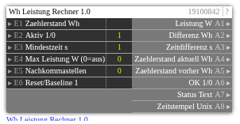

# Wh Leistung Rechner 1.0

**ID:** `19100842`  
**Importdatei:** [`19100842_lbs.php`](../../LBS/19100842/19100842_lbs.php)  
**Beschreibung:** Berechnet aus einem fortlaufenden Wh-Zaehler die aktuelle Leistung in W.

**Bild online:** https://raw.githubusercontent.com/x3muha/edomi-lbs/main/docs/images/19100842.png

## Hilfe

Version: 1.0

Wh Leistung Rechner 1.0

Zweck:
- Berechnet aus einem fortlaufenden Wh-Zaehler die aktuelle Leistung in W.
- Grundlage ist: Leistung W = Differenz Wh * 3600 / Zeitdifferenz Sekunden.
- Der letzte Zaehlerstand und Zeitstempel werden remanent gespeichert.

Betrieb:
- E1 = fortlaufender Zaehlerstand in Wh.
- E2 = Aktiv 1/0, Standard 1.
- E3 = Mindestzeit in Sekunden zwischen zwei gueltigen Berechnungen, Standard 1.
- E4 = optionale Plausibilitaetsgrenze in W, 0 = aus.
- E5 = Nachkommastellen fuer A1, A2 und A3, Standard 0.
- E6 = Reset/Baseline. Bei 1 wird der aktuelle Zaehlerstand als neue Basis gespeichert.

Ausgaenge:
- A1 = berechnete Leistung in W.
- A2 = verwendete Zaehlerdifferenz in Wh.
- A3 = verwendete Zeitdifferenz in Sekunden.
- A4 = aktueller Zaehlerstand in Wh.
- A5 = vorheriger Zaehlerstand in Wh.
- A6 = OK 1/0.
- A7 = Status Text.
- A8 = Unix-Zeitstempel der Berechnung.

Ablauf:
- Beim ersten gueltigen Zaehlerwert oder bei Reset wird nur die Baseline gesetzt.
- Bei jedem neuen Zaehlerwert wird die Differenz zum letzten gueltigen Wert berechnet.
- Ist die Zeitdifferenz kleiner als E3, wird noch keine neue Leistung berechnet.
- Wenn der Zaehlerstand kleiner als der vorherige Wert ist, wird ein Ruecksprung erkannt und eine neue Baseline gesetzt.
- Wenn E4 > 0 ist und die berechnete Leistung groesser als E4 ist, wird der Wert verworfen und die Baseline bleibt erhalten.
- Bei verworfenem Wert bleibt A1 auf dem letzten gueltigen Leistungswert.
- Bei gueltiger Berechnung werden Zaehlerstand und Zeitstempel als neue Baseline gespeichert.

Hinweise:
- Reiner LBS-Baustein, kein EXEC-Code.
- Der Baustein erwartet einen monoton steigenden Energiezaehler in Wh.
- Fuer kWh-Zaehler den Wert vor E1 mit 1000 multiplizieren.
