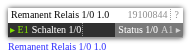

# Remanent Relais 1/0 1.0

**ID:** `19100844`  
**Importdatei:** [`19100844_lbs.php`](../../LBS/19100844/19100844_lbs.php)  
**Beschreibung:** Remanenter 1/0-Schaltzustand mit einem Eingang und einem Statusausgang.

**Bild online:** https://raw.githubusercontent.com/x3muha/edomi-lbs/main/docs/images/19100844.png

## Hilfe

Version: 1.0

Remanent Relais 1/0 (19100844)

Zweck:
- Speichert einen einfachen 1/0-Schaltzustand remanent.
- Gibt den zuletzt gespeicherten Zustand nach Neustart/Aktivierung wieder auf A1 aus.
- Nur die Werte 0 und 1 werden uebernommen.

Eingaenge:
- E1: Schalten 1/0. Bei Aktualisierung mit 1 wird der Status 1 gespeichert und ausgegeben. Bei Aktualisierung mit 0 wird der Status 0 gespeichert und ausgegeben.

Ausgaenge:
- A1: Status 1/0. Entspricht dem gespeicherten Zustand.

Ablauf:
- Bei jedem Aufruf gibt der Baustein den remanent gespeicherten Status auf A1 aus.
- Wenn E1 aktualisiert wird und exakt 0 oder 1 enthaelt, wird V1 remanent aktualisiert.
- Andere Werte an E1 werden ignoriert und aendern den gespeicherten Status nicht.

Hinweise:
- Reiner LBS-Baustein, kein EXEC-Code.
- Fuer mehrere Schaltziele A1 mit mehreren Ausgangsboxen verknuepfen.
